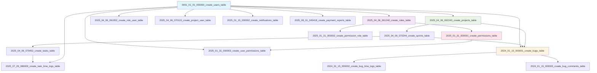
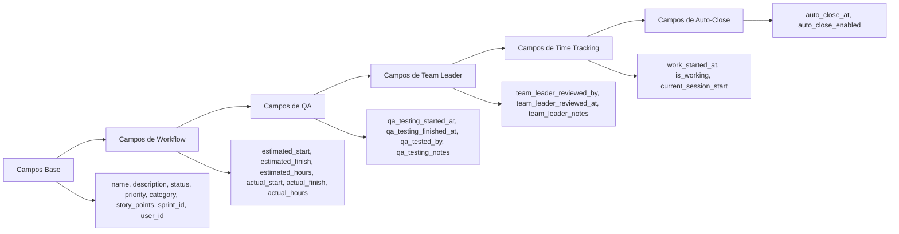
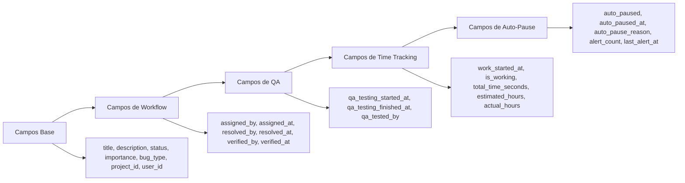
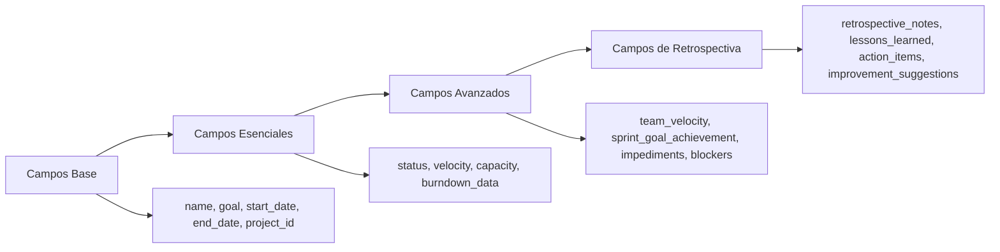
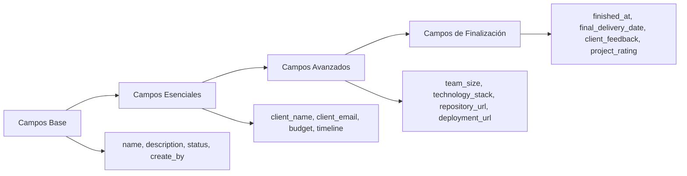
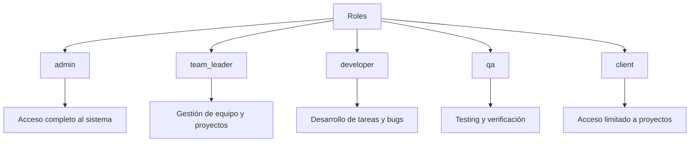
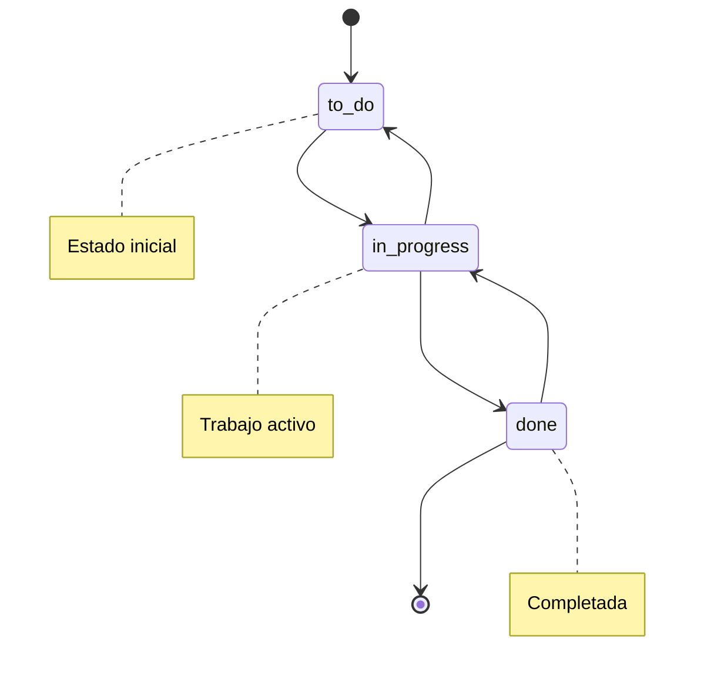
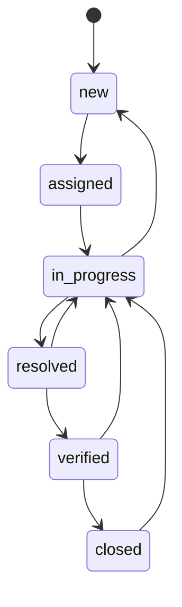
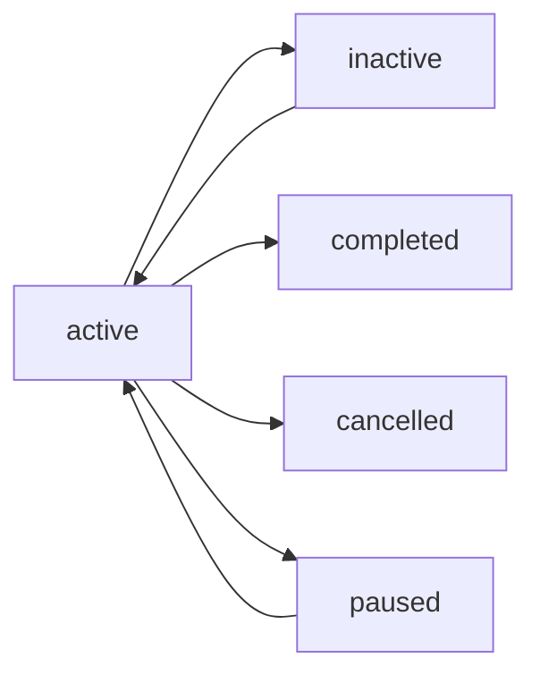

# Evolución del Esquema de Base de Datos - Sistema Tracker

## Cronología de Migraciones

### Fase 1: Estructura Base (Abril 2025)
```mermaid
timeline
    title Evolución del Esquema de Base de Datos
    section Fase 1: Estructura Base
        2025-04-06 : Crear users table
        2025-04-06 : Crear roles table
        2025-04-06 : Crear projects table
        2025-04-06 : Crear sprints table
        2025-04-06 : Crear tasks table
        2025-04-06 : Crear role_user table
        2025-04-06 : Crear project_user table
```

### Fase 2: Sistema de Bugs (Enero 2024)
```mermaid
timeline
    title Sistema de Gestión de Bugs
    section Fase 2: Bugs y Time Tracking
        2024-01-15 : Crear bugs table
        2024-01-15 : Crear bug_time_logs table
        2024-01-15 : Crear bug_comments table
        2024-01-15 : Crear suggestions table
```

### Fase 3: Sistema de Permisos (Enero 2025)
```mermaid
timeline
    title Sistema de Permisos Granulares
    section Fase 3: Permisos y Notificaciones
        2025-01-31 : Crear permissions table
        2025-01-31 : Crear permission_role table
        2025-01-31 : Crear user_permissions table
        2025-01-15 : Crear notifications table
```

### Fase 4: Workflow Avanzado (Julio 2025)
```mermaid
timeline
    title Workflow y Time Tracking Avanzado
    section Fase 4: Mejoras de Workflow
        2025-07-29 : Crear task_time_logs table
        2025-07-29 : Modificar tasks table para nuevo workflow
        2025-07-29 : Agregar estados de tareas
        2025-07-29 : Agregar rol team_leader
```

### Fase 5: Reportes y Pagos (Agosto 2025)
```mermaid
timeline
    title Sistema de Reportes y Pagos
    section Fase 5: Reportes y Analytics
        2025-08-01 : Crear payment_reports table
        2025-08-05 : Crear developer_activity_logs table
        2025-08-10 : Agregar campos avanzados a sprints
        2025-08-11 : Agregar campos de finalización a projects
```

## Diagrama de Dependencias de Migraciones



## Campos Agregados por Migraciones Posteriores

### Tabla `tasks` - Evolución de Campos



### Tabla `bugs` - Evolución de Campos



### Tabla `sprints` - Evolución de Campos



### Tabla `projects` - Evolución de Campos



## Enums y Estados del Sistema

### Roles del Sistema


### Estados de Tareas


### Estados de Bugs


### Estados de Proyectos


## Índices y Optimizaciones

### Índices de Rendimiento Implementados

```sql
-- Índices en bugs
CREATE INDEX idx_bugs_project_status ON bugs(project_id, status);
CREATE INDEX idx_bugs_user_status ON bugs(user_id, status);
CREATE INDEX idx_bugs_sprint_status ON bugs(sprint_id, status);
CREATE INDEX idx_bugs_importance_status ON bugs(importance, status);
CREATE INDEX idx_bugs_type_status ON bugs(bug_type, status);
CREATE INDEX idx_bugs_priority_score ON bugs(priority_score);

-- Índices en tasks
CREATE INDEX idx_tasks_sprint_status ON tasks(sprint_id, status);
CREATE INDEX idx_tasks_user_status ON tasks(user_id, status);
CREATE INDEX idx_tasks_priority ON tasks(priority);
CREATE INDEX idx_tasks_category ON tasks(category);

-- Índices en time logs
CREATE INDEX idx_task_time_logs_task_user ON task_time_logs(task_id, user_id);
CREATE INDEX idx_task_time_logs_started_at ON task_time_logs(started_at);
CREATE INDEX idx_bug_time_logs_bug_started ON bug_time_logs(bug_id, started_at);
CREATE INDEX idx_bug_time_logs_user_started ON bug_time_logs(user_id, started_at);

-- Índices en payment reports
CREATE INDEX idx_payment_reports_user_week ON payment_reports(user_id, week_start_date);
CREATE INDEX idx_payment_reports_week_range ON payment_reports(week_start_date, week_end_date);
CREATE INDEX idx_payment_reports_status ON payment_reports(status);

-- Índices en notifications
CREATE INDEX idx_notifications_user_read ON notifications(user_id, read);
CREATE INDEX idx_notifications_type_created ON notifications(type, created_at);

-- Índices en user permissions
CREATE INDEX idx_user_permissions_user_permission ON user_permissions(user_id, permission_id);
CREATE INDEX idx_user_permissions_expires_at ON user_permissions(expires_at);
```

## Métricas de Rendimiento

### Tamaños de Tablas Estimados
- **users**: ~100-1000 registros
- **projects**: ~50-200 registros
- **sprints**: ~200-1000 registros
- **tasks**: ~1000-10000 registros
- **bugs**: ~500-5000 registros
- **task_time_logs**: ~10000-100000 registros
- **bug_time_logs**: ~5000-50000 registros
- **payment_reports**: ~1000-5000 registros

### Consultas Optimizadas
- Búsqueda de tareas por sprint y estado
- Filtrado de bugs por proyecto y prioridad
- Reportes de tiempo por usuario y período
- Notificaciones no leídas por usuario
- Permisos activos por usuario
- Reportes de pago por semana

## Consideraciones de Escalabilidad

### Particionamiento Recomendado
- **task_time_logs**: Particionar por fecha
- **bug_time_logs**: Particionar por fecha
- **notifications**: Particionar por usuario
- **payment_reports**: Particionar por año

### Estrategias de Cache
- Cache de permisos de usuario
- Cache de roles y relaciones
- Cache de métricas de proyecto
- Cache de reportes de tiempo

### Backup y Recuperación
- Backup diario de tablas críticas
- Backup semanal completo
- Retención de 30 días para backups incrementales
- Retención de 1 año para backups completos
