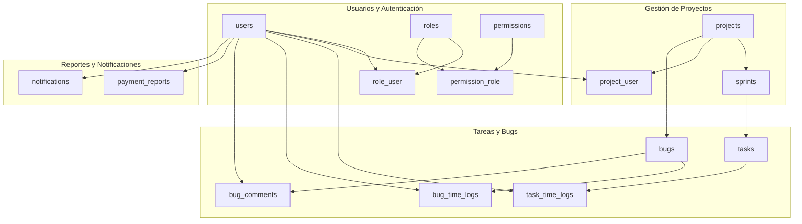
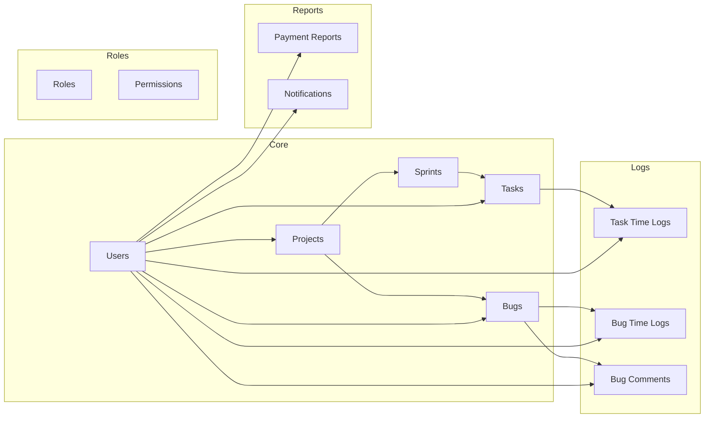
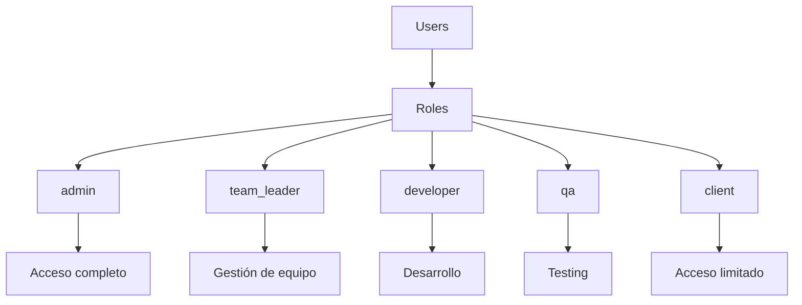
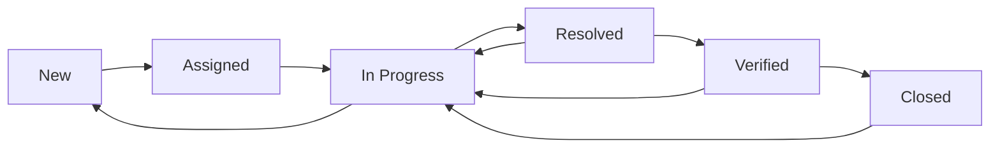

# Esquema de Base de Datos - Sistema Tracker (Formato Alternativo)

## Diagrama de Entidades Principales

## Diagrama de Relaciones Simplificado

## Estructura de Roles

## Workflow de Tareas

## Workflow de Bugs

## Tablas del Sistema

### Tablas Principales (15 total)

| Tabla | Propósito | Campos Principales |
|-------|-----------|-------------------|
| users | Usuarios del sistema | id, name, email, password |
| projects | Proyectos | id, name, description, status |
| sprints | Iteraciones ágiles | id, name, goal, start_date, end_date |
| tasks | Tareas de desarrollo | id, name, description, status, priority |
| bugs | Sistema de bugs | id, title, description, status, importance |
| roles | Roles de usuario | id, name, value |
| permissions | Permisos del sistema | id, name, display_name, module |

### Tablas de Relación

| Tabla | Propósito | Relaciones |
|-------|-----------|------------|
| role_user | Usuarios y roles | user_id, role_id |
| project_user | Proyectos y usuarios | project_id, user_id |
| permission_role | Permisos y roles | permission_id, role_id |

### Tablas de Logs y Comentarios

| Tabla | Propósito | Campos Principales |
|-------|-----------|-------------------|
| task_time_logs | Logs de tiempo en tareas | task_id, user_id, started_at, duration |
| bug_time_logs | Logs de tiempo en bugs | bug_id, user_id, started_at, duration |
| bug_comments | Comentarios en bugs | bug_id, user_id, content |

### Tablas de Reportes

| Tabla | Propósito | Campos Principales |
|-------|-----------|-------------------|
| payment_reports | Reportes de pago | user_id, week_start, total_hours, total_payment |
| notifications | Notificaciones | user_id, type, title, read |

## Características Técnicas

### Identificadores
- **UUIDs** como claves primarias en todas las tablas principales
- **Foreign Keys** con referencias apropiadas
- **Índices** optimizados para consultas frecuentes

### Soft Deletes
- Implementado en la mayoría de tablas
- Permite recuperación de datos eliminados
- Mantiene integridad referencial

### Enums Utilizados
- **Status**: active, inactive, completed, cancelled, paused
- **Task Status**: to_do, in_progress, done
- **Bug Status**: new, assigned, in_progress, resolved, verified, closed
- **Priority**: low, medium, high
- **Importance**: low, medium, high, critical

### Relaciones Principales
- **Users** → **Projects** (crea)
- **Projects** → **Sprints** (contiene)
- **Sprints** → **Tasks** (contiene)
- **Projects** → **Bugs** (contiene)
- **Users** → **Tasks** (asignado a)
- **Users** → **Bugs** (asignado a)

## Optimizaciones de Rendimiento

### Índices Clave
- `users.email` (único)
- `projects.status`
- `tasks.sprint_id, tasks.status`
- `bugs.project_id, bugs.status`
- `task_time_logs.task_id, task_time_logs.user_id`
- `bug_time_logs.bug_id, bug_time_logs.user_id`

### Consultas Optimizadas
- Búsqueda de tareas por sprint
- Filtrado de bugs por proyecto
- Reportes de tiempo por usuario
- Notificaciones no leídas
- Permisos de usuario

