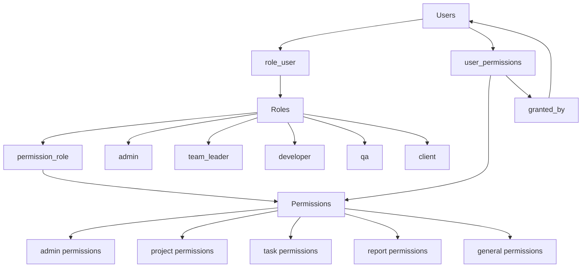
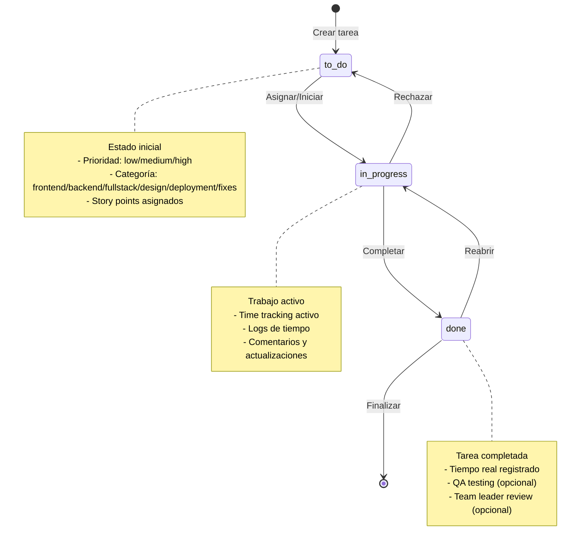
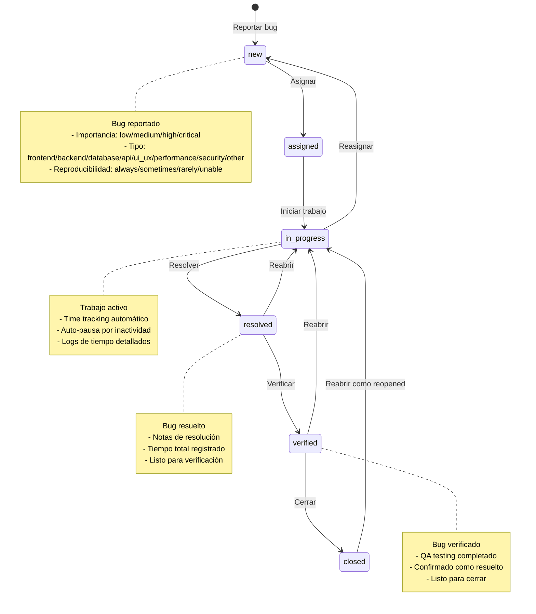
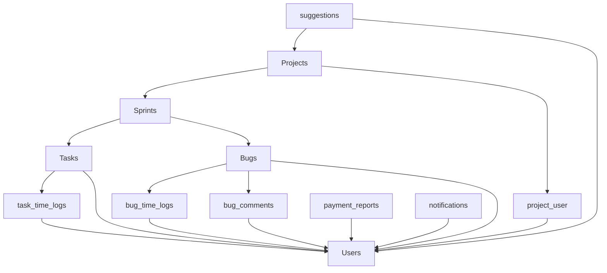

# Esquema de Base de Datos - Sistema Tracker

## Diagrama General del Esquema

```mermaid
erDiagram
    users {
        uuid id PK
        string name
        string email UK
        timestamp email_verified_at
        string password
        string remember_token
        timestamps
    }
    
    projects {
        uuid id PK
        string name
        string description
        enum status
        uuid create_by FK
        timestamps
        softDeletes
    }
    
    sprints {
        uuid id PK
        string name
        string goal
        date start_date
        date end_date
        uuid project_id FK
        timestamps
        softDeletes
    }
    
    tasks {
        uuid id PK
        string name
        string description
        enum status
        enum priority
        enum category
        integer story_points
        uuid sprint_id FK
        uuid user_id FK
        date estimated_start
        date estimated_finish
        integer estimated_hours
        date actual_start
        date actual_finish
        integer actual_hours
        timestamps
        softDeletes
    }
    
    bugs {
        uuid id PK
        string title
        text description
        longText long_description
        enum status
        enum importance
        enum bug_type
        string environment
        string browser_info
        string os_info
        longText steps_to_reproduce
        longText expected_behavior
        longText actual_behavior
        json attachments
        string tags
        enum reproducibility
        enum severity
        integer priority_score
        uuid sprint_id FK
        uuid project_id FK
        uuid user_id FK
        uuid assigned_by FK
        timestamp assigned_at
        integer estimated_hours
        integer estimated_minutes
        integer actual_hours
        integer actual_minutes
        integer total_time_seconds
        timestamp work_started_at
        boolean is_working
        timestamp auto_close_at
        integer alert_count
        timestamp last_alert_at
        boolean auto_paused
        timestamp auto_paused_at
        string auto_pause_reason
        longText resolution_notes
        uuid resolved_by FK
        timestamp resolved_at
        uuid verified_by FK
        timestamp verified_at
        timestamps
        softDeletes
    }
    
    roles {
        uuid id PK
        string name
        enum value
        timestamps
        softDeletes
    }
    
    permissions {
        uuid id PK
        string name UK
        string display_name
        text description
        string module
        boolean is_active
        timestamps
        softDeletes
    }
    
    payment_reports {
        uuid id PK
        uuid user_id FK
        date week_start_date
        date week_end_date
        decimal total_hours
        decimal hourly_rate
        decimal total_payment
        integer completed_tasks_count
        integer in_progress_tasks_count
        json task_details
        enum status
        uuid approved_by FK
        timestamp approved_at
        timestamp paid_at
        text notes
        timestamps
        softDeletes
    }
    
    notifications {
        uuid id PK
        uuid user_id FK
        string type
        string title
        text message
        json data
        boolean read
        timestamp read_at
        timestamps
        softDeletes
    }
    
    suggestions {
        bigint id PK
        uuid user_id FK
        uuid project_id FK
        string title
        text description
        enum status
        text admin_response
        uuid responded_by FK
        timestamp responded_at
        timestamps
    }
    
    role_user {
        uuid role_id FK
        uuid user_id FK
        timestamps
        softDeletes
    }
    
    project_user {
        uuid project_id FK
        uuid user_id FK
        timestamps
        softDeletes
    }
    
    permission_role {
        uuid permission_id FK
        uuid role_id FK
        timestamps
        softDeletes
    }
    
    user_permissions {
        uuid id PK
        uuid user_id FK
        uuid permission_id FK
        enum type
        timestamp expires_at
        text reason
        uuid granted_by FK
        timestamps
        softDeletes
    }
    
    task_time_logs {
        uuid id PK
        uuid task_id FK
        uuid user_id FK
        timestamp started_at
        timestamp paused_at
        timestamp resumed_at
        timestamp finished_at
        integer duration_seconds
        enum action
        text notes
        timestamps
        softDeletes
    }
    
    bug_time_logs {
        uuid id PK
        uuid bug_id FK
        uuid user_id FK
        timestamp started_at
        timestamp paused_at
        timestamp resumed_at
        timestamp finished_at
        integer duration_seconds
        text notes
        boolean auto_paused
        string auto_pause_reason
        timestamps
    }
    
    bug_comments {
        uuid id PK
        uuid bug_id FK
        uuid user_id FK
        longText content
        json attachments
        boolean is_internal
        enum comment_type
        timestamps
    }
    
    users ||--o{ projects : "crea"
    users ||--o{ role_user : "tiene"
    roles ||--o{ role_user : "asignado_a"
    users ||--o{ project_user : "participa_en"
    projects ||--o{ project_user : "tiene_usuarios"
    projects ||--o{ sprints : "contiene"
    sprints ||--o{ tasks : "contiene"
    sprints ||--o{ bugs : "contiene"
    users ||--o{ tasks : "asignado_a"
    users ||--o{ bugs : "asignado_a"
    users ||--o{ bugs : "asigna"
    users ||--o{ bugs : "resuelve"
    users ||--o{ bugs : "verifica"
    users ||--o{ task_time_logs : "registra"
    tasks ||--o{ task_time_logs : "tiene_logs"
    users ||--o{ bug_time_logs : "registra"
    bugs ||--o{ bug_time_logs : "tiene_logs"
    users ||--o{ bug_comments : "comenta"
    bugs ||--o{ bug_comments : "tiene_comentarios"
    users ||--o{ payment_reports : "genera"
    users ||--o{ payment_reports : "aprueba"
    users ||--o{ notifications : "recibe"
    users ||--o{ suggestions : "sugiere"
    projects ||--o{ suggestions : "recibe_sugerencias"
    users ||--o{ suggestions : "responde"
    permissions ||--o{ permission_role : "asignado_a"
    roles ||--o{ permission_role : "tiene_permisos"
    users ||--o{ user_permissions : "tiene_permisos_especiales"
    permissions ||--o{ user_permissions : "otorgado_a"
    users ||--o{ user_permissions : "otorga_permisos"
```

## Diagrama de Roles y Permisos



## Diagrama de Workflow de Tareas



## Diagrama de Workflow de Bugs



## Diagrama de Relaciones de Proyectos



## Características Principales del Esquema

### 1. **Sistema de UUIDs**
- Todas las tablas principales usan UUIDs como claves primarias
- Mejora la seguridad y escalabilidad

### 2. **Soft Deletes**
- La mayoría de entidades implementan soft deletes
- Permite recuperación de datos eliminados

### 3. **Sistema de Roles y Permisos**
- **Roles**: admin, team_leader, developer, qa, client
- **Permisos granulares** por módulo
- **Permisos temporales** con expiración
- **Permisos personalizados** por usuario

### 4. **Time Tracking Avanzado**
- **Task Time Logs**: Seguimiento detallado de tiempo en tareas
- **Bug Time Logs**: Seguimiento automático de tiempo en bugs
- **Auto-pausa** por inactividad
- **Métricas de productividad**

### 5. **Workflow Completo**
- **Tareas**: to_do → in_progress → done
- **Bugs**: new → assigned → in_progress → resolved → verified → closed
- **Estados intermedios** para QA y Team Leader review

### 6. **Sistema de Notificaciones**
- Notificaciones en tiempo real
- Diferentes tipos de notificaciones
- Sistema de lectura/no lectura

### 7. **Reportes de Pago**
- Cálculo automático de horas trabajadas
- Tarifas por hora configurables
- Aprobación y seguimiento de pagos

### 8. **Sistema de Sugerencias**
- Los clientes pueden hacer sugerencias
- Respuestas de administradores
- Seguimiento de estado

### 9. **Comentarios y Colaboración**
- Comentarios en bugs con tipos específicos
- Comentarios internos vs públicos
- Sistema de adjuntos

### 10. **Métricas y Analytics**
- Story points en tareas
- Prioridad y severidad en bugs
- Tiempo estimado vs real
- Índices de rendimiento

## Índices de Rendimiento

El esquema incluye índices optimizados para:
- Consultas por usuario y estado
- Filtros por proyecto y sprint
- Búsquedas por fecha
- Consultas de permisos
- Reportes de tiempo y pagos
