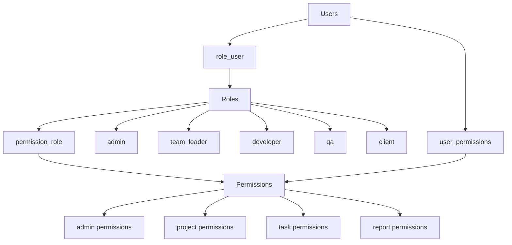
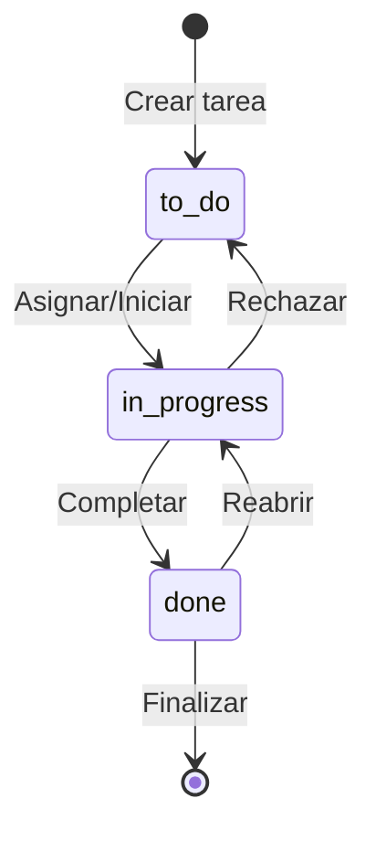
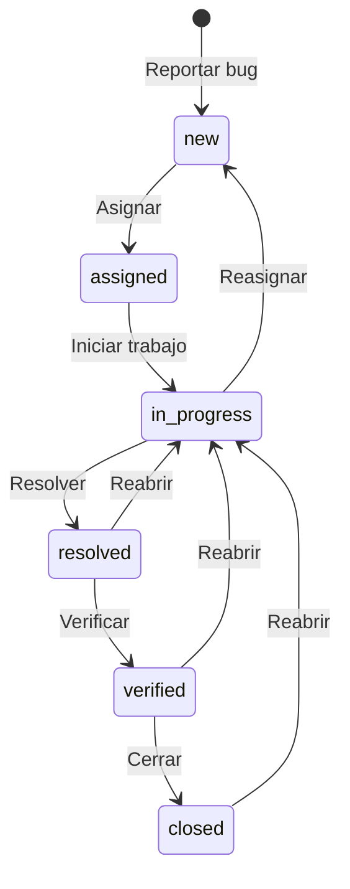
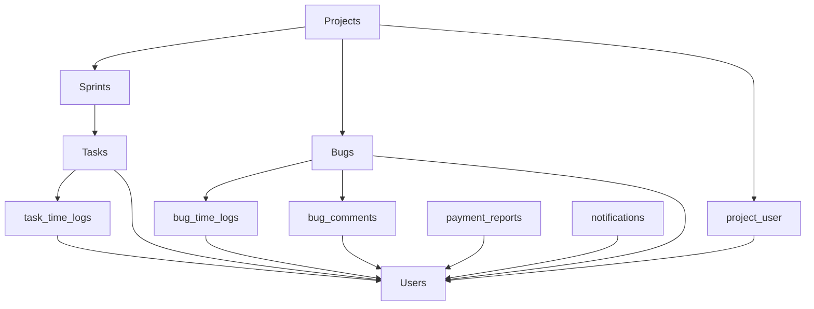

# Esquema de Base de Datos - Sistema Tracker (Versión Simplificada)

## Diagrama General del Esquema

```mermaid
erDiagram
    users {
        uuid id PK
        string name
        string email UK
        string password
        timestamps
    }
    
    projects {
        uuid id PK
        string name
        string description
        enum status
        uuid create_by FK
        timestamps
    }
    
    sprints {
        uuid id PK
        string name
        string goal
        date start_date
        date end_date
        uuid project_id FK
        timestamps
    }
    
    tasks {
        uuid id PK
        string name
        string description
        enum status
        enum priority
        integer story_points
        uuid sprint_id FK
        uuid user_id FK
        timestamps
    }
    
    bugs {
        uuid id PK
        string title
        text description
        enum status
        enum importance
        uuid project_id FK
        uuid user_id FK
        timestamps
    }
    
    roles {
        uuid id PK
        string name
        enum value
        timestamps
    }
    
    permissions {
        uuid id PK
        string name UK
        string display_name
        string module
        timestamps
    }
    
    payment_reports {
        uuid id PK
        uuid user_id FK
        date week_start_date
        decimal total_hours
        decimal total_payment
        enum status
        timestamps
    }
    
    notifications {
        uuid id PK
        uuid user_id FK
        string type
        string title
        boolean read
        timestamps
    }
    
    role_user {
        uuid role_id FK
        uuid user_id FK
        timestamps
    }
    
    project_user {
        uuid project_id FK
        uuid user_id FK
        timestamps
    }
    
    permission_role {
        uuid permission_id FK
        uuid role_id FK
        timestamps
    }
    
    task_time_logs {
        uuid id PK
        uuid task_id FK
        uuid user_id FK
        timestamp started_at
        integer duration_seconds
        timestamps
    }
    
    bug_time_logs {
        uuid id PK
        uuid bug_id FK
        uuid user_id FK
        timestamp started_at
        integer duration_seconds
        timestamps
    }
    
    bug_comments {
        uuid id PK
        uuid bug_id FK
        uuid user_id FK
        text content
        timestamps
    }
    
    users ||--o{ projects : "crea"
    users ||--o{ role_user : "tiene"
    roles ||--o{ role_user : "asignado_a"
    users ||--o{ project_user : "participa_en"
    projects ||--o{ project_user : "tiene_usuarios"
    projects ||--o{ sprints : "contiene"
    sprints ||--o{ tasks : "contiene"
    projects ||--o{ bugs : "contiene"
    users ||--o{ tasks : "asignado_a"
    users ||--o{ bugs : "asignado_a"
    users ||--o{ task_time_logs : "registra"
    tasks ||--o{ task_time_logs : "tiene_logs"
    users ||--o{ bug_time_logs : "registra"
    bugs ||--o{ bug_time_logs : "tiene_logs"
    users ||--o{ bug_comments : "comenta"
    bugs ||--o{ bug_comments : "tiene_comentarios"
    users ||--o{ payment_reports : "genera"
    users ||--o{ notifications : "recibe"
    permissions ||--o{ permission_role : "asignado_a"
    roles ||--o{ permission_role : "tiene_permisos"
```

## Diagrama de Roles y Permisos



## Diagrama de Workflow de Tareas



## Diagrama de Workflow de Bugs



## Diagrama de Relaciones de Proyectos



## Resumen de Tablas

### Tablas Principales
1. **users** - Usuarios del sistema
2. **projects** - Proyectos
3. **sprints** - Iteraciones ágiles
4. **tasks** - Tareas de desarrollo
5. **bugs** - Sistema de bugs
6. **roles** - Roles de usuario
7. **permissions** - Permisos del sistema

### Tablas de Relación
8. **role_user** - Relación usuarios-roles
9. **project_user** - Relación proyectos-usuarios
10. **permission_role** - Relación permisos-roles

### Tablas de Logs y Comentarios
11. **task_time_logs** - Logs de tiempo en tareas
12. **bug_time_logs** - Logs de tiempo en bugs
13. **bug_comments** - Comentarios en bugs

### Tablas de Reportes y Notificaciones
14. **payment_reports** - Reportes de pago
15. **notifications** - Notificaciones del sistema

## Características del Esquema

- **UUIDs** como claves primarias
- **Soft Deletes** en la mayoría de tablas
- **Sistema de roles** con 5 niveles
- **Time tracking** avanzado
- **Workflows** completos para tareas y bugs
- **Permisos granulares** por módulo
- **Reportes automáticos** de pago
- **Notificaciones** en tiempo real
