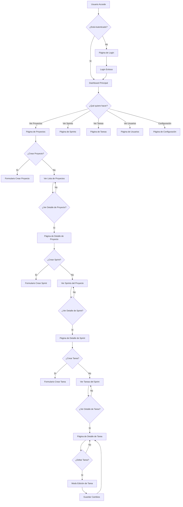
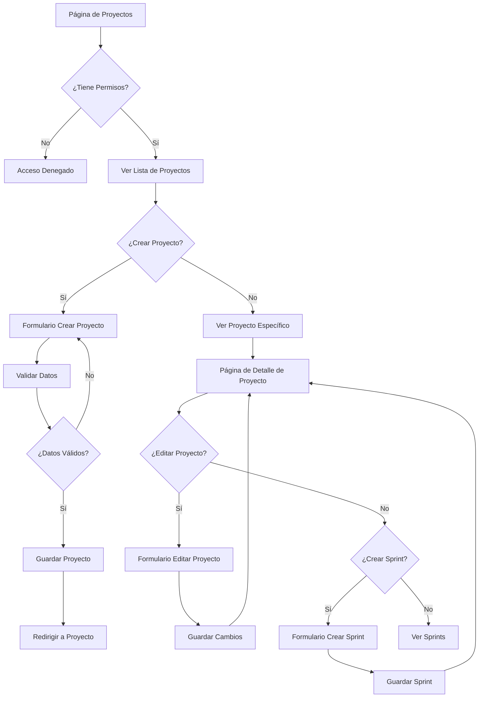
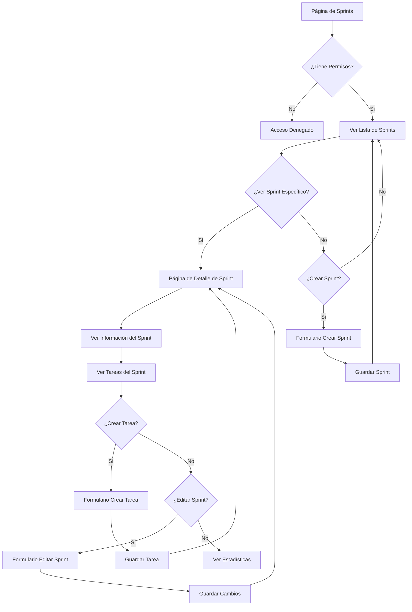
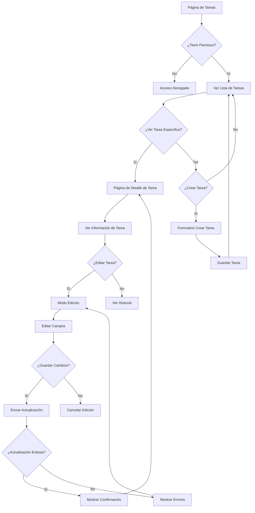

# 📊 Diagrama de Flujo del Sistema - Tracker

## 🎯 **Tipos de Usuarios**

### 👤 **Administrador (Admin)**
- Acceso completo a todas las funcionalidades
- Puede gestionar usuarios, proyectos, sprints y tareas
- Puede asignar roles y permisos

### 👨‍💻 **Desarrollador (Developer)**
- Puede ver proyectos asignados
- Puede ver y actualizar tareas asignadas
- Puede crear y editar tareas en sprints asignados

### 👥 **Usuario Regular (User)**
- Puede ver proyectos públicos
- Puede ver tareas (solo lectura)
- Acceso limitado a funcionalidades

---

## 🔄 **Flujo Principal del Sistema**

---

## 📋 **Flujo Detallado por Funcionalidad**

### 🏗️ **Gestión de Proyectos**

### 🏃 **Gestión de Sprints**

### ✅ **Gestión de Tareas**

---

## 🔐 **Sistema de Permisos**

### 👤 **Administrador**
- ✅ Crear, editar, eliminar proyectos
- ✅ Crear, editar, eliminar sprints
- ✅ Crear, editar, eliminar tareas
- ✅ Gestionar usuarios y roles
- ✅ Ver todas las estadísticas
- ✅ Acceso a configuración del sistema

### 👨‍💻 **Desarrollador**
- ✅ Ver proyectos asignados
- ✅ Ver sprints de proyectos asignados
- ✅ Crear y editar tareas en sprints asignados
- ✅ Actualizar estado de tareas propias
- ✅ Ver estadísticas de proyectos asignados
- ❌ Gestionar usuarios
- ❌ Eliminar proyectos/sprints

### 👥 **Usuario Regular**
- ✅ Ver proyectos públicos
- ✅ Ver sprints públicos
- ✅ Ver tareas (solo lectura)
- ✅ Ver estadísticas básicas
- ❌ Crear o editar contenido
- ❌ Acceso a configuración

---

## 🚨 **Problemas Identificados**

### 1. **Página de Detalle de Tarea**
- ❌ **Botón "Edit Task" no aparece**
- ❌ **Modo de edición no funciona**
- ❌ **Formulario de edición no se muestra**

### 2. **Navegación**
- ❌ **Botón "View more" en tareas no funciona correctamente**
- ❌ **Redirección entre páginas inconsistente**

### 3. **Permisos**
- ❌ **Sistema de permisos no está implementado completamente**
- ❌ **Usuarios pueden acceder a funcionalidades sin autorización**

### 4. **Validación**
- ❌ **Validación de formularios incompleta**
- ❌ **Manejo de errores inconsistente**

---

## 🎯 **Prioridades de Desarrollo**

### 🔥 **Alta Prioridad**
1. **Arreglar edición de tareas**
2. **Implementar navegación correcta**
3. **Completar sistema de permisos**

### 🔶 **Media Prioridad**
1. **Mejorar validación de formularios**
2. **Implementar manejo de errores**
3. **Optimizar rendimiento**

### 🔵 **Baja Prioridad**
1. **Agregar funcionalidades avanzadas**
2. **Mejorar UI/UX**
3. **Implementar reportes**

---

## 📝 **Próximos Pasos**

1. **Diagnosticar problema del botón "Edit Task"**
2. **Verificar estructura de componentes**
3. **Implementar funcionalidad de edición**
4. **Probar flujo completo**
5. **Documentar cambios**

---

*Este diagrama se actualizará conforme se resuelvan los problemas identificados.* 