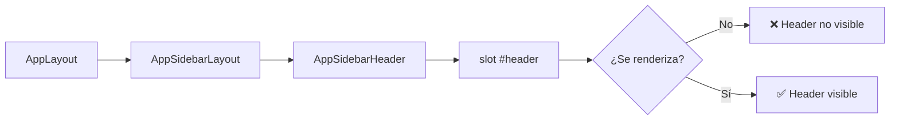

# 🔧 Diagnóstico: Flujo de Edición de Tareas

## 🎯 **Problema Actual**
El botón "Edit Task" no aparece en la página de detalle de tareas, impidiendo la edición.

## 🔍 **Análisis del Flujo Actual**

```mermaid
graph TD
    A[Usuario hace clic en 'View more' de una tarea] --> B[CardTask.vue]
    B --> C[window.location.href = /tasks/{id}]
    C --> D[TaskController::show]
    D --> E[Inertia render Task/Show.vue]
    E --> F[AppLayout :breadcrumbs]
    F --> G[AppSidebarLayout]
    G --> H[AppSidebarHeader]
    H --> I[slot #header]
    I --> J{¿Se renderiza el header?}
    
    J -->|No| K[❌ PROBLEMA: Header no se muestra]
    J -->|Sí| L[¿Aparece el botón 'Edit Task'?]
    
    L -->|No| M[❌ PROBLEMA: Botón no aparece]
    L -->|Sí| N[✅ Botón visible]
    
    N --> O[Usuario hace clic en 'Edit Task']
    O --> P[startEditing()]
    P --> Q[isEditing.value = true]
    Q --> R[¿Se activa modo edición?]
    
    R -->|No| S[❌ PROBLEMA: Modo edición no funciona]
    R -->|Sí| T[✅ Campos se vuelven editables]
    
    T --> U[Usuario edita campos]
    U --> V[Usuario hace clic en 'Save Changes']
    V --> W[saveChanges()]
    W --> X[form.put /tasks/{id}]
    X --> Y{¿Actualización exitosa?}
    
    Y -->|No| Z[❌ Mostrar errores]
    Y -->|Sí| AA[✅ Tarea actualizada]
```

## 🚨 **Puntos de Fallo Identificados**

### 1. **Renderizado del Header**


### 2. **Botón Edit Task**
```mermaid
graph LR
    A[Template #header] --> B[v-if="!isEditing"]
    B --> C[Button @click="startEditing"]
    C --> D{¿Se renderiza el botón?}
    D -->|No| E[❌ Botón no aparece]
    D -->|Sí| F[✅ Botón visible]
```

### 3. **Modo de Edición**
```mermaid
graph LR
    A[isEditing.value = true] --> B[v-if="isEditing"]
    B --> C[Campos editables]
    C --> D{¿Se muestran?}
    D -->|No| E[❌ Modo edición no funciona]
    D -->|Sí| F[✅ Campos editables]
```

## 🔧 **Diagnóstico Paso a Paso**

### **Paso 1: Verificar si el slot #header se renderiza**
```javascript
// En Task/Show.vue
<template #header>
  <div class="flex items-center justify-between p-6 border-b border-gray-200 bg-white">
    <!-- Contenido del header -->
  </div>
</template>
```

**Verificación:**
- [ ] ¿Se muestra el header con el botón "Back"?
- [ ] ¿Se muestra el título de la tarea?
- [ ] ¿Se muestra el botón "Edit Task"?

### **Paso 2: Verificar la variable reactiva isEditing**
```javascript
const isEditing = ref(false);
```

**Verificación:**
- [ ] ¿La variable se inicializa correctamente?
- [ ] ¿La función startEditing() se ejecuta?
- [ ] ¿isEditing.value cambia a true?

### **Paso 3: Verificar el formulario**
```javascript
const form = useForm({
    name: props.task.name,
    description: props.task.description,
    // ... otros campos
});
```

**Verificación:**
- [ ] ¿Los datos de la tarea se cargan correctamente?
- [ ] ¿El formulario se inicializa con los valores correctos?
- [ ] ¿Los campos se actualizan cuando se edita?

## 🛠️ **Soluciones Propuestas**

### **Solución 1: Verificar estructura de componentes**
```bash
# Verificar que AppSidebarLayout tenga el slot #header
grep -n "slot name=\"header\"" resources/js/layouts/app/AppSidebarLayout.vue
```

### **Solución 2: Agregar debugging**
```javascript
// En Task/Show.vue
const startEditing = () => {
    console.log('🔍 DEBUG: startEditing called');
    console.log('🔍 DEBUG: isEditing before:', isEditing.value);
    isEditing.value = true;
    console.log('🔍 DEBUG: isEditing after:', isEditing.value);
    console.log('🔍 DEBUG: form data:', form.data());
}
```

### **Solución 3: Verificar template**
```vue
<!-- Agregar debugging visual -->
<template #header>
  <div class="flex items-center justify-between p-6 border-b border-gray-200 bg-white">
    <!-- Debug info -->
    <div class="text-xs text-red-500">
      Debug: isEditing = {{ isEditing }}, task.name = {{ task.name }}
    </div>
    
    <!-- Contenido normal -->
    <div class="flex items-center space-x-4">
      <!-- ... -->
    </div>
  </div>
</template>
```

## 📋 **Checklist de Verificación**

### **Frontend**
- [ ] ¿Se renderiza el slot #header?
- [ ] ¿Aparece el botón "Edit Task"?
- [ ] ¿La función startEditing() se ejecuta?
- [ ] ¿isEditing.value cambia correctamente?
- [ ] ¿Los campos se vuelven editables?

### **Backend**
- [ ] ¿TaskController::show devuelve los datos correctos?
- [ ] ¿La ruta PUT /tasks/{id} existe?
- [ ] ¿Los permisos están configurados correctamente?
- [ ] ¿La validación funciona?

### **Navegación**
- [ ] ¿El botón "View more" funciona?
- [ ] ¿La URL se genera correctamente?
- [ ] ¿La redirección funciona?

## 🎯 **Próximos Pasos**

1. **Ejecutar diagnóstico paso a paso**
2. **Agregar debugging visual**
3. **Verificar estructura de componentes**
4. **Probar funcionalidad de edición**
5. **Documentar solución**

---

*Este documento se actualizará conforme se resuelva el problema.* 