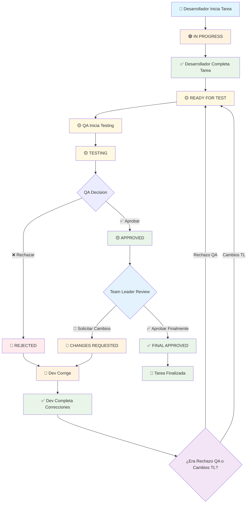

# 🔄 Diagrama de Flujo del Workflow de Tareas

## 📋 Estados Principales

```
🟢 = Estado Activo
🟡 = Estado de Revisión
🔴 = Estado de Rechazo/Cambios
✅ = Estado Final Aprobado
```

## 🔄 Flujo Completo del Workflow



## 📊 Estados Detallados

### 🚀 **Fase de Desarrollo**
```
Estado: IN PROGRESS
- Desarrollador trabajando activamente
- Timer corriendo
- Puede pausar/reanudar
```

### 🟡 **Fase de QA Testing**
```
Estado: READY FOR TEST
- Tarea completada por desarrollador
- Disponible para QA testing
- QA puede asignarse y comenzar testing

Estado: TESTING
- QA activamente testeando
- Timer de QA corriendo
- QA puede pausar/reanudar testing
```

### ✅ **Aprobación QA**
```
Estado: APPROVED
- QA aprobó la tarea
- Lista para revisión del Team Leader
- Team Leader puede aprobar o solicitar cambios
```

### ❌ **Rechazo QA**
```
Estado: REJECTED
- QA rechazó la tarea
- Dev debe corregir y completar nuevamente
- Vuelve a READY FOR TEST después de corrección
```

### 🔄 **Cambios Solicitados por Team Leader**
```
Estado: CHANGES REQUESTED
- Team Leader solicitó cambios
- Dev debe implementar cambios
- Vuelve a READY FOR TEST después de corrección
```

### ✅ **Aprobación Final**
```
Estado: FINAL APPROVED
- Team Leader aprobó finalmente
- Tarea completamente terminada
- Proyecto marcado como completado
```

## 🔄 **Ciclos de Re-trabajo**

### **Ciclo 1: Rechazo QA**
```
QA Rechaza → Dev Corrige → Dev Completa → READY FOR TEST → QA Testing → ...
```

### **Ciclo 2: Cambios TL**
```
TL Solicita Cambios → Dev Implementa → Dev Completa → READY FOR TEST → QA Re-testing → ...
```

## 📋 **Reglas de Negocio**

### **QA Testing**
- ✅ QA puede aprobar o rechazar
- ✅ Si rechaza, debe dar razón
- ✅ Si aprueba, va al Team Leader

### **Team Leader Review**
- ✅ Puede aprobar finalmente
- ✅ Puede solicitar cambios
- ✅ Si solicita cambios, QA debe re-testear

### **Desarrollador**
- ✅ Debe completar tarea para ir a QA
- ✅ Si QA rechaza, debe corregir y completar
- ✅ Si TL pide cambios, debe implementar y completar

### **Estados de QA Status**
```
pending → ready_for_test → testing → approved/rejected
```

### **Estados de Team Leader**
```
null → requested_changes → final_approval
```

## 🎯 **Puntos Clave del Workflow**

1. **QA siempre tiene la primera palabra** después del desarrollo
2. **Team Leader solo revisa tareas aprobadas por QA**
3. **Si TL pide cambios, QA debe re-testear** (no va directo a TL)
4. **Cada corrección vuelve al inicio del flujo QA**
5. **Solo TL puede dar aprobación final**
6. **El workflow es cíclico hasta aprobación final**

## 🔧 **Implementación Técnica**

### **Transiciones Automáticas**
```php
// Desarrollador completa → READY FOR TEST
'qa_status' => 'ready_for_test'

// QA aprueba → APPROVED
'qa_status' => 'approved'

// QA rechaza → REJECTED
'qa_status' => 'rejected'

// TL pide cambios → CHANGES REQUESTED
'team_leader_requested_changes' => true

// Dev completa cambios → READY FOR TEST (re-testing)
'qa_status' => 'ready_for_test'
'team_leader_requested_changes' => false

// TL aprueba finalmente → FINAL APPROVED
'team_leader_final_approval' => true
```

### **Notificaciones Automáticas**
- 📧 QA notificado cuando tarea lista para testing
- 📧 Dev notificado cuando QA rechaza
- 📧 Dev notificado cuando TL pide cambios
- 📧 QA notificado cuando dev completa cambios
- 📧 TL notificado cuando QA aprueba
- 📧 Proyecto notificado cuando TL aprueba finalmente
