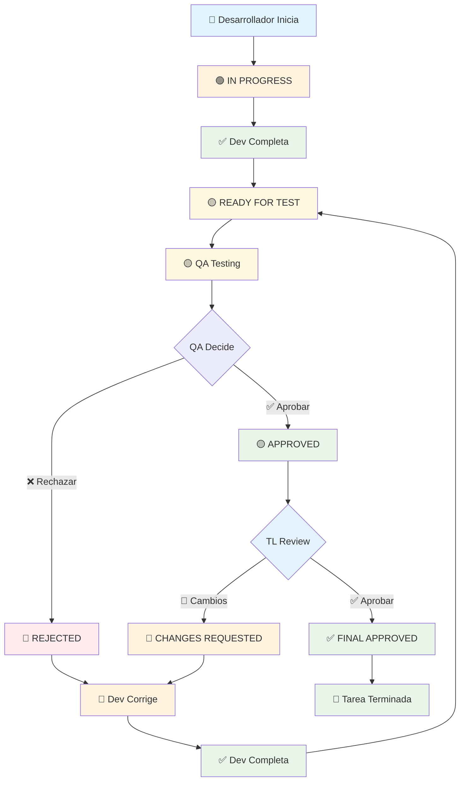

# 🔄 Diagrama de Flujo del Workflow de Tareas

## 📊 Flujo Principal



## 📋 Estados del Sistema

### 🚀 **Desarrollo**
- **IN PROGRESS**: Desarrollador trabajando activamente
- **DONE**: Tarea completada por desarrollador

### 🟡 **QA Testing**
- **READY FOR TEST**: Lista para QA testing
- **TESTING**: QA testeando activamente
- **APPROVED**: QA aprobó la tarea

### ❌ **Rechazos**
- **REJECTED**: QA rechazó la tarea
- **CHANGES REQUESTED**: TL solicitó cambios

### ✅ **Aprobaciones**
- **FINAL APPROVED**: TL aprobó finalmente
- **TAREA TERMINADA**: Proceso completado

## 🔄 Ciclos de Re-trabajo

### **Ciclo 1: QA Rechaza**
```
QA Rechaza → Dev Corrige → Dev Completa → READY FOR TEST → QA Testing
```

### **Ciclo 2: TL Pide Cambios**
```
TL Pide Cambios → Dev Implementa → Dev Completa → READY FOR TEST → QA Re-testing
```

## 📊 Tabla de Transiciones

| Estado Actual | Acción | Estado Siguiente |
|---------------|--------|------------------|
| IN PROGRESS | Dev completa | READY FOR TEST |
| READY FOR TEST | QA inicia testing | TESTING |
| TESTING | QA aprueba | APPROVED |
| TESTING | QA rechaza | REJECTED |
| APPROVED | TL aprueba | FINAL APPROVED |
| APPROVED | TL pide cambios | CHANGES REQUESTED |
| REJECTED | Dev completa corrección | READY FOR TEST |
| CHANGES REQUESTED | Dev completa cambios | READY FOR TEST |

## 🎯 Reglas Clave

1. **QA siempre testea primero** después del desarrollo
2. **TL solo revisa tareas aprobadas por QA**
3. **Si TL pide cambios, QA debe re-testear**
4. **Cada corrección vuelve al inicio del flujo QA**
5. **Solo TL puede dar aprobación final**

## 🔧 Implementación Técnica

### **QA Status Flow**
```
pending → ready_for_test → testing → approved/rejected
```

### **Team Leader Flow**
```
null → requested_changes → final_approval
```

### **Transiciones Automáticas**
- **Dev completa** → `qa_status = 'ready_for_test'`
- **QA aprueba** → `qa_status = 'approved'`
- **QA rechaza** → `qa_status = 'rejected'`
- **TL pide cambios** → `team_leader_requested_changes = true`
- **Dev completa cambios** → `qa_status = 'ready_for_test'` (re-testing)
- **TL aprueba finalmente** → `team_leader_final_approval = true`
